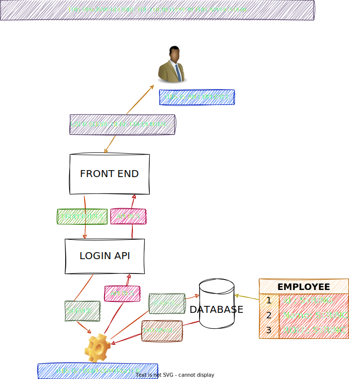
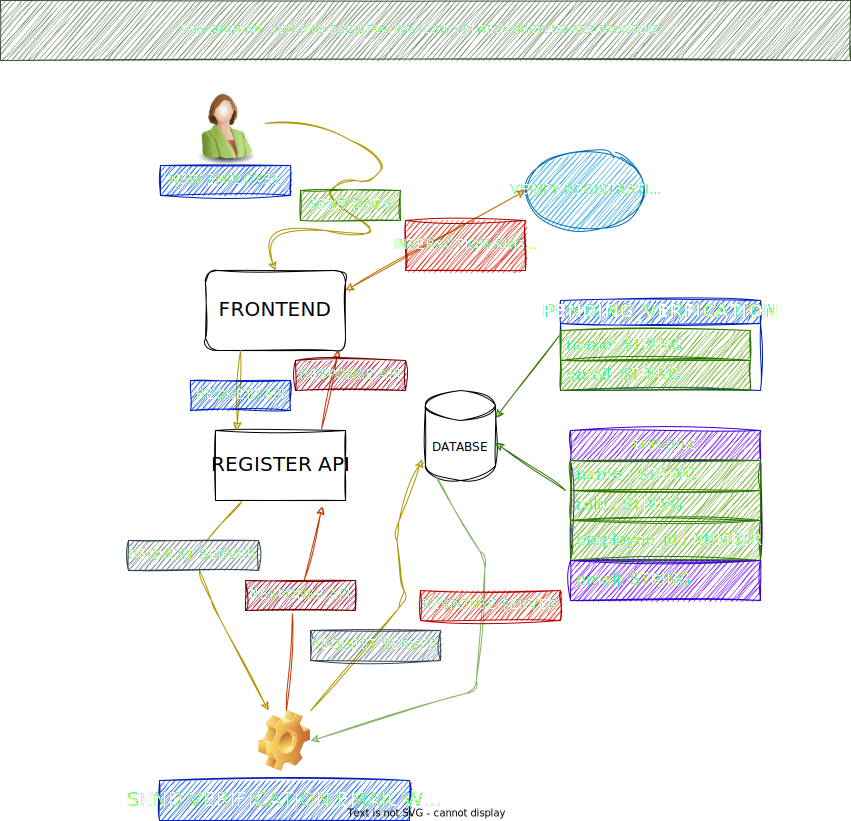

# Welcome to `rari`

> [!Warning]
> This project is work in progress and lacking most of its documentation.
> Anything might change and code will move a lot. We do not encourage using it yet.
> We'll have an official announcement before we migrate, so stay tuned.


---

# Invoice Management System 🚀

**Enterprise-level Invoice Management System** designed for scalability and offline-first usage.  
*Hybrid Architecture: Electron + Express + Docker.*

---

## 🎯 Table of Contents

* [📋 Overview](#-overview)
* [🎥 Demo & Visuals](#-demo--visuals)
* [🏗️ Architecture](#️-architecture)
* [✨ Key Features](#-key-features)
* [⚠️ Known Limitations](#️-known-limitations--architecture-decisions)
* [🛠 Tech Stack](#-tech-stack)
* [⚡ Installation & Setup](#-installation--setup)
* [🚀 Post-Installation Setup](#-post-installation-setup-first-time-users)
* [🔗 Deep Linking](#-deep-linking)
* [📡 API Documentation](#-api-documentation)
* [🗺 Roadmap](#-roadmap)
* [🤝 Contributing](#-contributing)

---

## 📋 Overview

**Invoice App** `v1.0.0` is a robust, offline-first desktop application that brings the power of a full-stack web server to the desktop. Use it to manage invoices, suppliers, and fiscal workflows with enterprise-grade security.

**Unique Selling Point**: Unlike standard Electron apps, this project runs a **real Node.js/Express server** and a **Dockerized MySQL database** locally on the user's machine, packaged into a single `.exe`.

> [!IMPORTANT]
> This project depends on **Docker Desktop** (for the database) and **LibreOffice** (for PDF generation via Carbone.io). Both components must be installed and functional.

---

## 🎥 Demo & Visuals

### Video Demonstration

See the application in action:


### Workflow Visualizations

To understand the core business logic, refer to our detailed flow diagrams:

| Login Flow | Register Flow | Invoice Lifecycle |
| :---: | :---: | :---: |
| [](architecture/flows/login_flow.svg) | [](architecture/flows/register_flow.svg) | [](architecture/flows/invoice_flow.svg) |

---

## 🏗️ Architecture

> **[Read the detailed Technical Architecture Document (ARCHITECTURE.md)](ARCHITECTURE.md)**

This project solves the "Client-Server on Desktop" challenge through a hybrid design:

1. **Orchestrator (Electron)**: Manages the lifecycle of the entire stack. It silently forks a child process to run the backend and checks for Docker availability before launching the UI.
2. **Logic Core (Express + TypeScript)**: A standalone API providing REST endpoints, authentication (JWT), and PDF generation.
3. **Data Layer (MySQL @ Docker)**: Zero-config database deployment. The app controls the Docker Desktop daemon to ensure the DB is up.

### Key Technical Achievements

* **Deep Linking**: Integration of `invoice-app://` protocol for magic link authentication (Email -> Desktop).
* **Encapsulated Build**: The backend is compiled and bundled *inside* the Electron resource fork, creating a truly portable server.
* **Fiscal Isolation**: Strict data segregation by fiscal year at the SQL level.

---

## ✨ Key Features

### 🚀 High-Volume Capacity

* Optimized `INV-FY2025-000000000001` ID format.
* `BIGINT` atomic counters for collision-proof scaling.

### 🔐 Enterprise Security

* **Local Server Security**: Validates requests even if they come from localhost.
* **HttpOnly Cookies**: JWT storage safe from XSS.
* **Audit Trail**: Every `INSERT`/`UPDATE`/`DELETE` is logged with the user ID.

### 💼 DFC Workflow

* Dedicated interface for "Direction Financière et Comptable".
* Validation/Rejection workflow with mandatory comments.

---

## ⚠️ Known Limitations & Architecture Decisions

### Deep Linking (Cold Start)

The application supports deep linking (e.g., clicking a "Reset Password" link in an email) **only when the application is already running (Warm Start)**.

* **Behavior:** If the app is fully closed, clicking a magic link **will not launch the application** because the server is completely shut down.
* **Reason:** This is a deliberate architectural choice to maintain a strict **"Local First"** philosophy. We chose not to rely on external buffering servers or complex cloud relays. Since the local backend (Docker + Node) is completely stopped when the app is closed, the deep link cannot be processed.

---

## 🛠 Tech Stack

**Dual-Stack Monorepo:**

| Frontend (Client) | Backend (Server) | Infrastructure            |
| ----------------- | ---------------- | ------------------------- |
| **React 18**      | **Node.js**      | **Electron 39** (Wrapper) |
| Vite              | Express 5        | **Docker** (Database)     |
| Tailwind CSS      | TypeScript       | MySQL 8.2                 |
| HashRouter        | Carbone.io (PDF) | Electron Builder          |

---

## ⚡ Installation & Setup

### Prerequisites

* **Docker Desktop**: Must be installed and running.
* **LibreOffice**: Required for PDF generation (v24+ recommended).
* **Node.js**: v18 or later.

### Quick Start (Development)

> [!IMPORTANT]
> **In development mode**, you must manually start Docker. Only the production `.exe` can auto-start Docker containers.

```bash
# 1. Clone the repository
git clone https://github.com/Dioman-Keita/invoice-app.git
cd invoice-app

# 2. Install dependencies
npm install
npm install --prefix client
npm install --prefix server

# 3. Start Docker (REQUIRED for dev mode)
cd server
docker compose up -d
cd ..

# 4. Build the backend (CRITICAL)
# This must be run every time you modify TypeScript code in the server folder
npm run build --prefix server

# 5. Start the application
npm run electron:dev
```

> [!CAUTION]
> Unlike the frontend (Vite), the backend does **not** hot-reload inside Electron. You **must** re-run `npm run build --prefix server` (or `cd server && npm run build`) for your changes to be reflected in the app.

---

> [!TIP]
> **Development vs Production:**
>
> * **Dev mode** (`npm run electron:dev`): You must manually run `docker compose up -d` in the `server/` folder first.
> * **Production** (`.exe`): The application automatically manages Docker containers on startup.

#### 🛠️ Database Initialization (First Use)

The database is **automatically initialized** when the Docker container starts for the first time. The `server/mysql/db/db.sql` script is mounted to `/docker-entrypoint-initdb.d`, which MySQL executes on startup.

1. Run `npm run electron:dev`.
2. Wait for Docker containers to spin up.
3. The database is ready! No manual SQL execution required.

### Build for Production (`.exe`)

This command compiles the entire stack into a single standalone installer:

```bash
npm run dist
```

*Output: `release/Invoice App Setup 1.0.0.exe`*

---

## 🚀 Post-Installation Setup (First Time Users)

After installing the `.exe` file, the setup is **fully automated**.

### Requirements

* **Docker Desktop**: Must be installed and running.
* **LibreOffice**: Required for PDF generation.

### Installation & Launch

1. **Install the Application**: Run the setup `.exe`.
2. **Start Docker Desktop**: Ensure it is running.
3. **Launch the App**: Open the installed application.
    * The app checks for the MySQL Docker image.
    * It verifies the container status.
    * **The database is automatically initialized** on the first run.

> [!TIP]
> **First Run**: The first launch might take a few extra seconds as it pulls the MySQL image and initializes the database volume.

#### 👤 Default User Accounts

The app initializes with default accounts.

| Role | Email | Password | Department |
| :--- | :--- | :--- | :--- |
| **Admin** | `admin@invoice-app.local` | `admin123` | Finance |
| **Invoice Manager** | `manager@invoice-app.local` | `manager123` | Facturation |
| **DFC Agent** | `dfc@invoice-app.local` | `dfc123` | Comptabilité |

> [!WARNING]
> **Security Note**: These are default accounts for initial setup. For production use, **change these passwords immediately** after first login.

### Troubleshooting Launch

If the app fails to start Docker:

1. Close the application.
2. Manually start **Docker Desktop**.
3. Relaunch the app.

---

### 📧 Email Configuration (Optional)

> [!NOTE]
> **Email Functionality**: After installing the `.exe` file, email functionality (password reset, verification emails, etc.) **will not be functional** by default. This is by design for security and flexibility reasons.

To enable email functionality in your custom build:

1. **Create a Google Account** (if you don't have one)
2. **Enable Two-Factor Authentication (2FA)** on your Google account:
   * Go to your Google Account settings
   * Navigate to Security → 2-Step Verification
   * Follow the setup process
3. **Generate an App Password**:
   * Still in Security settings, go to "App passwords"
   * Select "Mail" and your device
   * Generate the password and **copy it** to a secure location (notepad, password manager, etc.)
4. **Download/Clone the Project**:
   * Download the ZIP file or clone the repository
   * Extract/open the project folder
5. **Configure Email Settings**:
   * Navigate to `invoice-app/server/`
   * Open the `.env.example` file
   * Locate the `{#email configuration}` section
   * Set `GMAIL_USER` to your Google account email address
   * Set `GMAIL_PASS` to the app password you generated and saved
6. **Rebuild the Application**:
   * Return to the project root (`invoice-app/`)
   * Run the build command:

     ```bash
     npm run dist
     ```

   * The new `.exe` file in the `release/` folder will have fully functional email capabilities

> [!WARNING]
> **Security**: Keep your app password secure. Never commit it to version control or share it publicly.

---

## 🔗 Deep Linking

The app registers `invoice-app://` in the Windows Registry.

* **Warm Start**: If the app is open, the renderer receives the link instantly via `IPC`.
* **Cold Start**: If the app is closed, clicking a deep link **will not launch the application** because the server is completely shut down (see *Known Limitations*).

---

## 📡 API Documentation

The embedded server exposes a full REST API at `http://localhost:3000/api`.

* **Auth**: `/api/auth/login`, `/api/auth/register`
* **Invoices**: `/api/invoices` (CRUD), `/api/invoices/:id/dfc/approve`
* **Stats**: `/api/stats/dashboard`

---

## 🗺 Roadmap

* [x] **Phase 1**: Hybrid Architecture & Docker Integration
* [x] **Phase 2**: Deep Linking (Warm Start) & Asset Protection
* [ ] **Phase 3**: Auto-updater
* [ ] **Phase 4**: **Future: Add "Lite Mode" using SQLite for users without Docker**
* [ ] **Phase 5**: Multi-machine sync (Remote DB option)
* [ ] **Phase 6**: Cross-platform support (macOS & Linux)
* [ ] **Phase 7**: Turborepo integration for better monorepo management
* [ ] **Phase 8**: Complete Frontend migration to TypeScript (TSX)
* [ ] **Phase 9**: Frontend architecture migration to feature-based design
* [ ] **Phase 10**: Backend model extraction and refactoring
* [ ] **Phase 11**: Progressive migration to Prisma ORM
* [ ] **Phase 12**: Systematic Jest integration for comprehensive pre-launch testing

---

## 🤝 Contributing

See [CONTRIBUTING.md](CONTRIBUTING.md) for details.

1. Fork & Clone
2. `git checkout -b my-feature/description`
3. Submit PR

---

**License**: MIT
