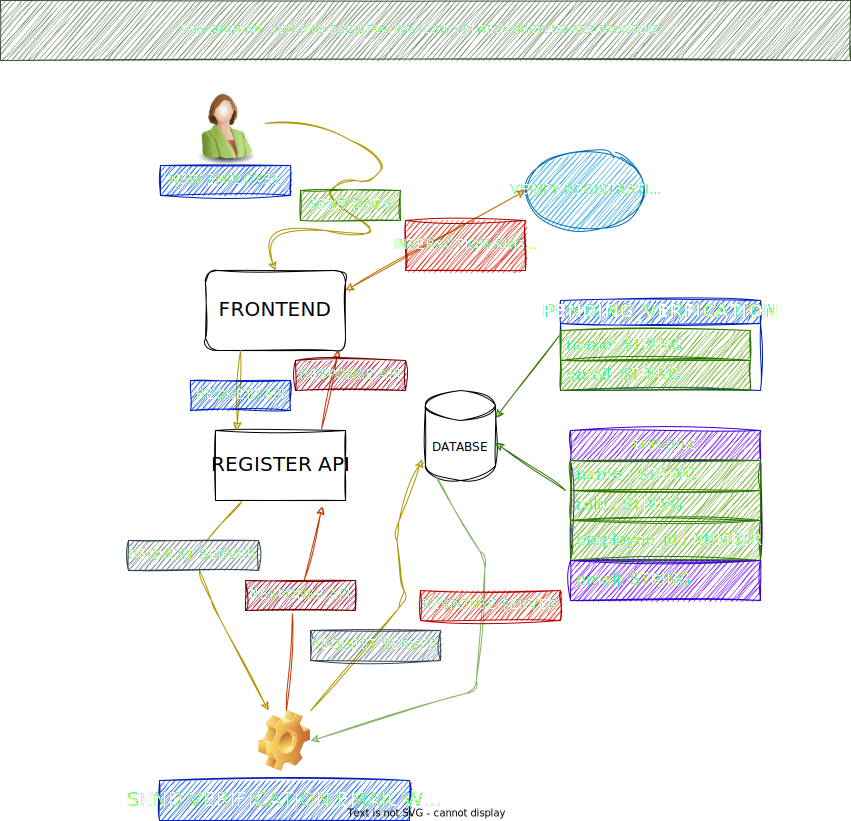
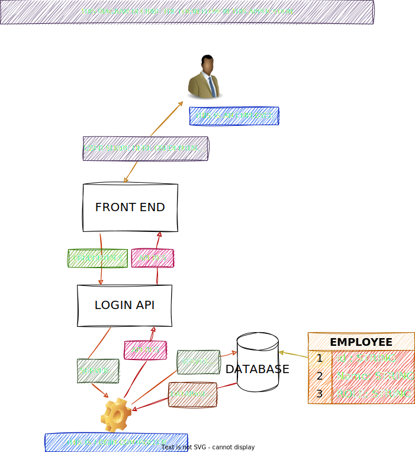
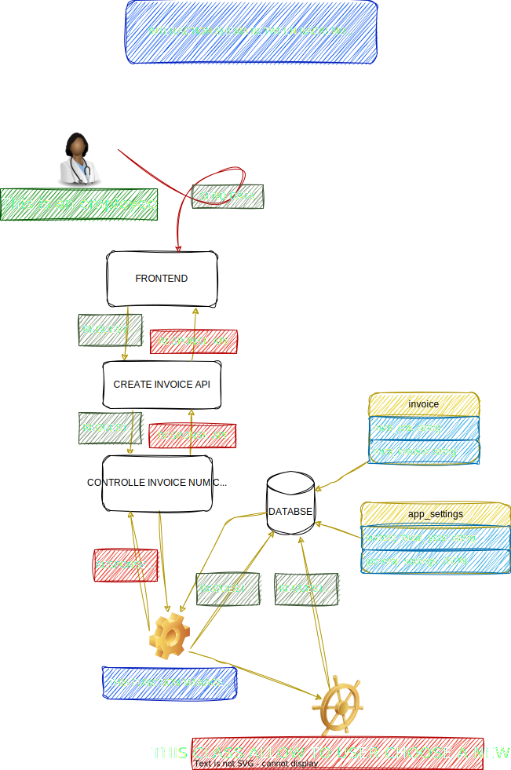

## invoice-app

Application de gestion de factures (CMDT) avec un frontend React et un backend Node/Express. L’authentification utilise des JWT stockés en cookies HttpOnly pour plus de sécurité.

### Sommaire
- Aperçu
- Pile technique
- Architecture du projet
- Installation rapide
- Configuration (.env)
- Scripts utiles
- Authentification (JWT + Cookie HttpOnly)
- Endpoints clés (Auth)
- Lancer le projet en développement
- Qualité (lint) et formatage
- Roadmap (à compléter)

### Aperçu
- Frontend: React + Vite + Tailwind CSS
- Backend: Node.js + Express + TypeScript
- Base de données: MySQL avec système de traçabilité utilisateur
- Sécurité: JWT signés côté serveur, stockés en Cookie HttpOnly (SameSite, Secure en prod)
- Gestion d'inactivité: Déconnexion automatique après 5min (30min avec "Se souvenir de moi")
- Tracking d'activité: Enregistrement automatique de toutes les actions utilisateur

### Pile technique
- **Client**: React, Vite, React Router, Tailwind CSS, React Hook Form, Zod
- **Serveur**: Express, TypeScript, jsonwebtoken, bcrypt, cors, cookie-parser, MySQL
- **Sécurité**: JWT HttpOnly, CORS configuré, validation des données, audit trail
- **Outils**: ESLint, Prettier, Logger custom, ActivityTracker, AuditLogger

### Architecture du projet
```
invoice-app/
  client/                 # Frontend (Vite/React)
    src/
      features/           # Domaine (ex: invoices, connection)
      components/         # UI partagée
      pages/              # Pages
      routes/             # Routes app
      services/           # Hooks/services front
  server/                 # Backend (Express/TS)
    controllers/          # Contrôleurs (user, invoice, supplier)
    middleware/           # middlewares (authGuard, validator)
    routes/               # Routes Express (authRoute, ...)
    services/             # Services (userToken, email, ids, notifications)
    utils/                # Utilitaires (ApiResponder, Logger, PasswordHasher)
    models/               # Modèles accès DB (User, Invoice, Supplier)
```

### Installation rapide
```bash
# à la racine du projet
npm install

# dépendances serveur
cd server && npm install && cd ..

# dépendances client
cd client && npm install && cd ..
```

### Configuration (.env)
Créer un fichier `.env` dans `server/` avec (exemple):
```
JWT_SECRET_KEY=change_me
NODE_ENV=development
APP_URL=http://localhost:5173
PORT=3000

# Exemple DB (adapter à votre driver/implémentation)
DB_HOST=localhost
DB_USER=root
DB_PASSWORD=secret
DB_NAME=cmdt_invoice_db
```

Si front et back sont sur des origines différentes, activer CORS avec `credentials` côté serveur et utiliser `credentials: 'include'` côté client.

### Base de données
- **Script initial** : `server/db/db.sql`

#### Règles et contraintes récentes
- Facture:
  - `status` par défaut à "Non" (choix visible côté UI, valeur par défaut côté front et back)
  - `num_invoice` limité à 12 caractères numériques (1..12 chiffres au front, stockage `VARCHAR(12)` recommandé)
  - `amount` plafonné à `100 000 000 000` (validation front et back; côté SQL, utiliser un type numérique suffisant, ex. `DECIMAL(12,0)`)
- Fournisseur:
  - L'email est remplacé par le **numéro de compte** `account_number` (exactement 12 chiffres, unique)

- Numéro de compte fournisseur (si vous avez déjà des données):
  - Renommer la colonne `supplier.email` en `supplier.account_number` (type `CHAR(12)` ou `VARCHAR(12)`),
  - Normaliser les valeurs existantes en 12 chiffres (suppression des non-chiffres, tronquer/padder),
  - Créer un index unique sur `supplier(account_number)`.
  - Exemple (MySQL 8+):
    ```sql
    ALTER TABLE supplier CHANGE COLUMN email account_number CHAR(12) NOT NULL;
    UPDATE supplier SET account_number = LPAD(SUBSTRING(REGEXP_REPLACE(account_number, '[^0-9]', ''), 1, 12), 12, '0');
    CREATE UNIQUE INDEX ux_supplier_account_number ON supplier(account_number);
    -- Optionnel (si supporté):
    -- ALTER TABLE supplier ADD CONSTRAINT chk_supplier_account_number_digits CHECK (account_number REGEXP '^[0-9]{12}$');
    ```

### Scripts utiles
```bash
# racine
npm run dev           # (optionnel) proxy/outil global si présent

# serveur
cd server
npm run dev           # démarre l'API en mode dev (ts-node nodemon)
npm run build         # compile TypeScript
npm start             # démarre la version compilée

# client
cd client
npm run dev           # démarre le front (Vite)
npm run build         # build de prod
npm run preview       # prévisualisation du build
```

### Authentification (JWT + Cookie HttpOnly)
- Login: le serveur vérifie les identifiants, génère un JWT et le place dans un cookie `auth_token` (HttpOnly, SameSite configuré, Secure en prod).
- Requêtes protégées: le navigateur renvoie automatiquement le cookie; un middleware `authGuard` vérifie le JWT et peuple `req.user`.
- Logout: suppression du cookie via `res.clearCookie('auth_token', ...)`.
- Avantage: le token n'est pas accessible en JavaScript (mitigation XSS) et reste envoyé automatiquement par le navigateur.

### Système d'autorisation et traçabilité
- **`req.user`** : Contient les informations de l'utilisateur connecté (`id`, `email`, `role`)
- **Traçabilité** : Toutes les actions sont associées à l'utilisateur qui les effectue
- **Contrôle d'accès** : Système de rôles (admin, manager, user) avec middleware `roleGuard`
- **Isolation des données** : Chaque utilisateur voit ses propres données (sauf admins)

### Endpoints clés (Auth)
- **POST** `/auth/login` → credentials `{ email, password, role, rememberMe }` → set cookie + retourne l'utilisateur
- **POST** `/auth/register` → inscription avec validation email et termes d'utilisation
- **POST** `/auth/forgot-password` → demande de réinitialisation de mot de passe
- **POST** `/auth/reset-password` → réinitialisation avec token
- **GET** `/auth/status` → statut d'authentification avec gestion d'inactivité
- **POST** `/auth/silent-refresh` → rafraîchissement silencieux du token
- **GET** `/auth/profile` → profil de l'utilisateur connecté (protégé)
- **POST** `/auth/logout` → déconnexion avec nettoyage des activités
- **POST** `/auth/admin/create-user` → création d'utilisateur (admin seulement)

### Endpoints Factures (protégés)
- POST `/invoices` → créer une facture (associée à l'utilisateur connecté)
- GET  `/invoices` → lister les factures (ses propres factures, ou toutes si admin)
- GET  `/invoices/:id` → récupérer une facture (vérification des permissions)

Le frontend doit appeler ces endpoints avec `credentials: 'include'` pour inclure les cookies cross-origin.

### Flux d'authentification
## Création de compte
<p align="center">
  
</p>

## Connexion

<p align="center">
  
</p>

## Flux de création de facture
<p align="center">
  
</p>

### Lancer le projet en développement
```bash
# terminal 1 (serveur)
cd server && npm run dev

# terminal 2 (client)
cd client && npm run dev
```

### Qualité (lint) et formatage
```bash
# Exemple (adapter selon config du repo)
npm run lint
npm run format
```

### Nouvelles fonctionnalités récentes
- [x] **Système de gestion d'inactivité** : Déconnexion automatique après 5min/30min
- [x] **Tracking d'activité** : Enregistrement automatique de toutes les actions utilisateur
- [x] **Rafraîchissement silencieux** : Renouvellement automatique des tokens
- [x] **Validation avancée** : React Hook Form + Zod pour la validation côté client
- [x] **Interface responsive** : Design moderne avec Tailwind CSS
- [x] **Gestion des rôles** : admin, invoice_manager, dfc_agent avec permissions granulaires
- [x] **Audit trail** : Traçabilité complète des actions dans la base de données

### Roadmap (à compléter)
- [ ] Tests d'intégration (auth, invoices, activity tracking)
- [ ] Interface utilisateur pour la gestion des rôles
- [ ] Export/Import des données
- [ ] Notifications en temps réel
- [ ] CI/CD avec tests automatisés

---
Documentation vivante: ce README sera mis à jour au fil du projet.
