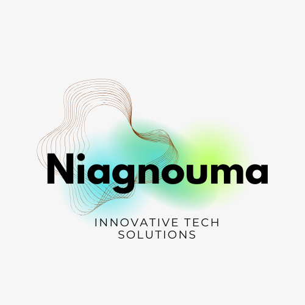

# Invoice Management System (CMDT) 🚀

**Enterprise-level Invoice Management System** designed for scalability and offline-first usage.  
*Hybrid Architecture: Electron + Express + Docker.*

<!-- markdownlint-disable MD033 -->
<p align="center">
  
</p>
<!-- markdownlint-enable MD033 -->

---

## 🎯 Table of Contents

* [Overview](#-overview)
* [🎥 Demo & Visuals](#-demo--visuals)
* [🏗️ Architecture](#️-architecture)
* [✨ Key Features](#-key-features)
* [🛠 Tech Stack](#-tech-stack)
* [⚡ Installation & Setup](#-installation--setup)
* [🔗 Deep Linking](#-deep-linking)
* [📡 API Documentation](#-api-documentation)
* [🗺 Roadmap](#-roadmap)
* [🤝 Contributing](#-contributing)

---

## 📋 Overview

**Invoice App** `v0.0.0` is a robust, offline-first desktop application that brings the power of a full-stack web server to the desktop. Use it to manage invoices, suppliers, and fiscal workflows with enterprise-grade security.

**Unique Selling Point**: Unlike standard Electron apps, this project runs a **real Node.js/Express server** and a **Dockerized MySQL database** locally on the user's machine, packaged into a single `.exe`.

> [!IMPORTANT]  
> Ce projet dépend de **Docker Desktop** (pour la base de données) et de **LibreOffice** (pour la génération des PDF via Carbone.io). Ces deux composants doivent être installés et fonctionnels.

---

## 🎥 Demo & Visuals

### Video Demonstration

See the application in action:
**[▶️ Watch the Demo Video](architechture/video/demo.mp4)**

### Workflow Visualizations

To understand the core business logic, refer to our detailed flow diagrams:

| Login Flow | Register Flow | Invoice Lifecycle |
|:---:|:---:|:---:|
| [](architechture/flows/login_flow.svg) | [](architechture/flows/register_flow.svg) | [](architechture/flows/invoice_flow.svg) |

---

## 🏗️ Architecture

> **[Read the detailed Technical Architecture Document (ARCHITECTURE.md)](ARCHITECTURE.md)**

This project solves the "Client-Server on Desktop" challenge through a hybrid design:

1. **Orchestrator (Electron)**: Manages the lifecycle of the entire stack. It silently forks a child process to run the backend and checks for Docker availability before launching the UI.
2. **Logic Core (Express + TypeScript)**: A standalone API providing REST endpoints, authentication (JWT), and PDF generation.
3. **Data Layer (MySQL @ Docker)**: Zero-config database deployment. The app controls the Docker Desktop daemon to ensure the DB is up.

### Key Technical Achievements

* **Deep Linking**: Integration of `invoice-app://` protocol for magic link authentication (Email -> Desktop).
* **Encapsulated Build**: The backend is compiled and bundled *inside* the Electron resource fork, creating a truly portable server.
* **Fiscal Isolation**: Strict data segregation by fiscal year at the SQL level.

---

## ✨ Key Features

### 🚀 High-Volume Capacity

* Optimized `INV-FY2025-000000000001` ID format.
* `BIGINT` atomic counters for collision-proof scaling.

### 🔐 Enterprise Security

* **Local Server Security**: Validates requests even if they come from localhost.
* **HttpOnly Cookies**: JWT storage safe from XSS.
* **Audit Trail**: Every `INSERT`/`UPDATE`/`DELETE` is logged with the user ID.

### 💼 DFC Workflow

* Dedicated interface for "Direction Financière et Comptable".
* Validation/Rejection workflow with mandatory comments.

---

## 🛠 Tech Stack

**Dual-Stack Monorepo:**

| Frontend (Client) | Backend (Server) | Infrastructure |
| ----------------- | ---------------- | -------------- |
| **React 18**      | **Node.js**      | **Electron 39** (Wrapper) |
| Vite              | Express 5        | **Docker** (Database) |
| Tailwind CSS      | TypeScript       | MySQL 8.2 |
| HashRouter        | Carbone.io (PDF) | Electron Builder |

---

## ⚡ Installation & Setup

### Prerequisites

* **Docker Desktop** (Must be running)
* **LibreOffice** (Version 25.8 recommandée pour la génération PDF)
* Node.js 18+

### Quick Start (Development)

Services must be started in this exact order:

#### 1. Database Management (Docker)

```bash
cd server
docker compose up -d    # Create and start containers
docker compose start    # Start services (if already created)
docker compose down     # Stop containers
```

##### 🛠️ Database Initialization (First Use)

If this is your first time using the app, you must manually create the database structure:

1. Open the file `server/mysql/db/db.sql` and copy its entire content (**Ctrl + A** then **Ctrl + C**).
2. In your terminal, access the MySQL container:

   ```bash
   docker exec -it final_mysql mysql -u root -p
   ```

3. Enter the password (defined in your `.env`).
4. Once in the MySQL prompt, run:

   ```sql
   use cmdt_invoice_db;
   ```

5. Paste the copied content directly into the terminal (**Ctrl + V**) to create all tables.

#### 2. Start the Server (Backend)

```bash
cd server
npm run dev
```

#### 3. Start the Interface (Vite + Electron)

> [!IMPORTANT]
> Run `npm run electron:dev` ONLY after starting Docker and the server.

```bash
# From the project root
npm run electron:dev
```

### Build for Production (`.exe`)

This command compiles the React app, the TS server, and bundles everything into an installer:

```bash
npm run dist
```

*Output: `release/Invoice App Setup 0.0.0.exe`*

---

## 🔗 Deep Linking

The app registers `invoice-app://` in the Windows Registry.

* **Warm Start**: If the app is open, the renderer receives the link instantly via `IPC`.
* **Cold Start**: If closed, Electron launches, waits for the server to boot (health check), and *then* processes the pending link.

---

## 📡 API Documentation

The embedded server exposes a full REST API at `http://localhost:3000/api`.

* **Auth**: `/api/auth/login`, `/api/auth/register`
* **Invoices**: `/api/invoices` (CRUD), `/api/invoices/:id/dfc/approve`
* **Stats**: `/api/stats/dashboard`

---

## 🗺 Roadmap

* [x] **Phase 1**: Hybrid Architecture & Docker Integration
* [x] **Phase 2**: Deep Linking & Asset Protection
* [ ] **Phase 3**: Auto-updater
* [ ] **Phase 4**: Multi-machine sync (Remote DB option)

---

## 🤝 Contributing

See [CONTRIBUTING.md](CONTRIBUTING.md) for details.

1. Fork & Clone
2. `git checkout -b my-feature`
3. Submit PR

---

**Author**: Dioman Keita  
**License**: MIT
